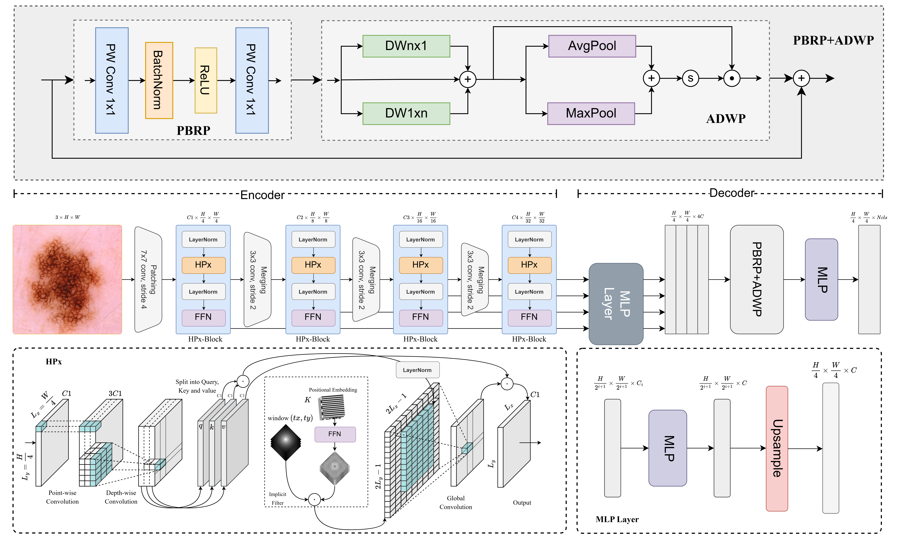

# HyenaMed: Lightweight Skin Lesion Segmentation via Convolutional Global Context Modeling

[](https://ieeexplore.ieee.org/document/11601590)
[](LICENSE)
[](https://www.python.org/)
[](https://pytorch.org/)

Official PyTorch implementation of our paper **[HyenaMed: Lightweight Skin Lesion Segmentation via Convolutional Global Context Modeling](https://ieeexplore.ieee.org/document/11601590)**, presented at the **2026 International Conference on Frontiers of Engineering and Emerging Technologies (FET)**, Sakhir, Bahrain.

> Z. Haider, H. Haiyu, M. A. F. Butt and M. Ali, "HyenaMed: Lightweight Skin Lesion Segmentation via Convolutional Global Context Modeling," *2026 International Conference on Frontiers of Engineering and Emerging Technologies (FET)*, Sakhir, Bahrain, 2026, pp. 1-7, doi: 10.1109/FET68771.2026.11601590.

## Overview

Accurate skin lesion segmentation is a critical step toward automated dermoscopic diagnosis, but most high-performing segmentation models rely on heavy backbones that are impractical for deployment on resource-constrained or point-of-care devices. **HyenaMed** addresses this gap by adapting convolutional global-context modeling (inspired by [HyenaPixel](https://github.com/spravil/HyenaPixel)) into an extremely lightweight encoder-decoder architecture for skin lesion segmentation, achieving competitive accuracy at a fraction of the computational cost of standard CNN and transformer-based baselines.

**Key highlights:**
- **~0.68M parameters** and **~0.30 GFLOPs** — orders of magnitude smaller than typical segmentation backbones
- Large effective receptive field via convolutional global context modeling, without the quadratic cost of self-attention
- Evaluated on three public dermoscopic benchmarks: **ISIC 2016**, **ISIC 2017**, and **ISIC 2018**
- Built on top of [MMSegmentation](https://github.com/open-mmlab/mmsegmentation) for reproducible training, testing, and benchmarking

## Architecture



HyenaMed is a lightweight encoder-decoder segmentation network. The **encoder** stacks four **HPx-Blocks** at progressively downsampled resolutions (H/4, H/8, H/16, H/32), each combining a LayerNorm → **HPx** (a convolutional global-context mixer inspired by Hyena, using depth-wise/point-wise convolutions with an implicit positional filter and long-range global convolution) → LayerNorm → FFN, with 3×3 stride-2 convolutions merging features between stages. Multi-scale features are projected to a common channel dimension by a shared **MLP layer** and upsampled to a common resolution. The **decoder** fuses these features through a **PBRP+ADWP** module: a Point-wise Bottleneck Residual Path (PW Conv 1×1 → BatchNorm → ReLU → PW Conv 1×1) combined with an Attentive Dual-Window Pooling branch (parallel n×1 and 1×n depth-wise convolutions, followed by average/max pooling gated through a sigmoid attention weight), before a final MLP head predicts the segmentation mask.

## Results

| Dataset  | aAcc  | mIoU  | mDice | mPrecision | mRecall | Params | GFLOPs |
|----------|:-----:|:-----:|:-----:|:----------:|:-------:|:------:|:------:|
| ISIC2016 | 96.67 | 89.51 | 90.34 | 94.54      | 94.15   | 0.68M  | 0.30G  |
| ISIC2017 | 92.65 | 83.63 | 90.95 | 91.93      | 90.10   | 0.68M  | 0.30G  |
| ISIC2018 | 91.85 | 82.56 | 90.31 | 89.95      | 90.70   | 0.68M  | 0.30G  |

Full comparisons against DeepLabV3+, MobileNetV3, Fast-SCNN, and SegFormer baselines are provided in the paper.

## Installation

```bash
conda create -n hyenapixel python=3.10
conda activate hyenapixel
pip install torch torchvision --index-url https://download.pytorch.org/whl/cu118
pip install -e .
```

## Dataset Preparation

Download the ISIC 2016, ISIC 2017, and ISIC 2018 lesion segmentation datasets from the [ISIC Archive](https://challenge.isic-archive.com/data/) and arrange them in MMSegmentation format:

```
segmentation/data/
├── isic2016/
│   ├── images/
│   │   ├── training/
│   │   └── validation/
│   └── annotations/
│       ├── training/
│       └── validation/
├── isic2017/
│   └── ...
└── isic2018/
    └── ...
```

Segmentation masks should use the suffix `_Segmentation.png`, matching the dataset config files under `mmsegmentation/configs/_base_/datasets/`.

## Usage

All commands are run from the `segmentation/` directory.

### Training

```bash
python mmsegmentation/tools/train.py mmsegmentation/configs/hpx_former_s18/segformer_hpx-former-s18-90k_isic2016-224x224.py
python mmsegmentation/tools/train.py mmsegmentation/configs/hpx_former_s18/segformer_hpx-former-s18-90k_isic2017-224x224.py
python mmsegmentation/tools/train.py mmsegmentation/configs/hpx_former_s18/segformer_hpx-former-s18-90k_isic2018-224x224.py
```

Multi-GPU training:

```bash
CUDA_VISIBLE_DEVICES=0,1 bash mmsegmentation/tools/dist_train.sh mmsegmentation/configs/hpx_former_s18/segformer_hpx-former-s18-90k_isic2016-256x256.py 2
```

### Testing

```bash
python mmsegmentation/tools/test.py \
    mmsegmentation/configs/hpx_former_s18/segformer_hpx-former-s18-90k_isic2016-224x224.py \
    work_dirs/segformer_hpx-former-s18-90k_isic2016-224x224/iter_90000.pth \
    --show-dir results/segformer_hpx-former-s18-90k_isic2016-224x224/test/ \
    --work-dir results/segformer_hpx-former-s18-90k_isic2016-224x224/test/
```

### Model Complexity (Params / FLOPs)

```bash
python mmsegmentation/tools/analysis_tools/get_flops.py \
    mmsegmentation/configs/hpx_former_s18/segformer_hpx-former-s18-90k_isic2016-224x224.py --shape 256
```

### Inference Speed Benchmark

```bash
python mmsegmentation/tools/analysis_tools/benchmark.py \
    mmsegmentation/configs/hpx_former_s18/segformer_hpx-former-s18-90k_isic2016-224x224.py \
    work_dirs/segformer_hpx-former-s18-90k_isic2016-224x224/iter_90000.pth
```

## Comparison Baselines

We benchmark HyenaMed against the following baselines, trained under the same protocol using MMSegmentation:

- **DeepLabV3+**
- **MobileNetV3**
- **Fast-SCNN**
- **SegFormer**

Configuration files for each baseline are available under `mmsegmentation/configs/`.

## Acknowledgments

Our implementation builds on and is grateful to the following open-source projects:

- [HyenaPixel: Global Image Context with Convolutions](https://github.com/spravil/HyenaPixel)
- [MambaU-Lite: A Lightweight Model based on Mamba and Integrated Channel-Spatial Attention for Skin Lesion Segmentation](https://github.com/nqnguyen812/MambaU-Lite)
- [MMSegmentation](https://github.com/open-mmlab/mmsegmentation)

## Citation

If you find this work useful for your research, please cite:

```bibtex
@inproceedings{haider2026hyenamed,
  author    = {Z. Haider and H. Haiyu and M. A. F. Butt and M. Ali},
  title     = {HyenaMed: Lightweight Skin Lesion Segmentation via Convolutional Global Context Modeling},
  booktitle = {2026 International Conference on Frontiers of Engineering and Emerging Technologies (FET)},
  address   = {Sakhir, Bahrain},
  pages     = {1--7},
  year      = {2026},
  doi       = {10.1109/FET68771.2026.11601590}
}
```

## License

This project is released under the [MIT License](LICENSE).
